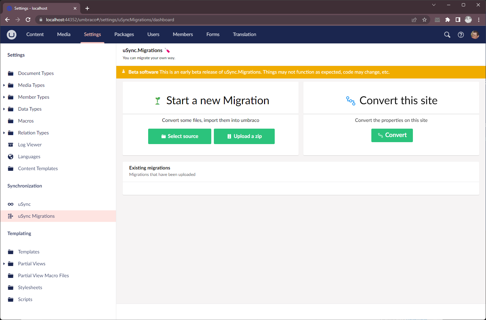
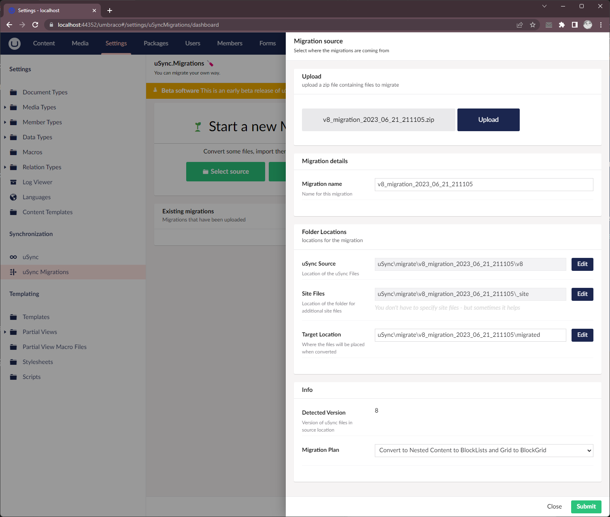
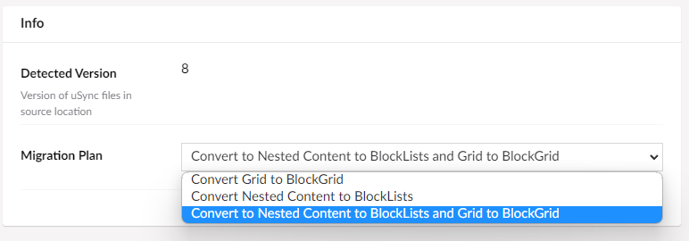
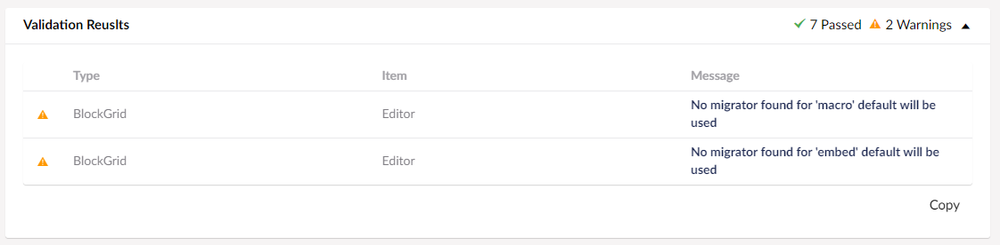
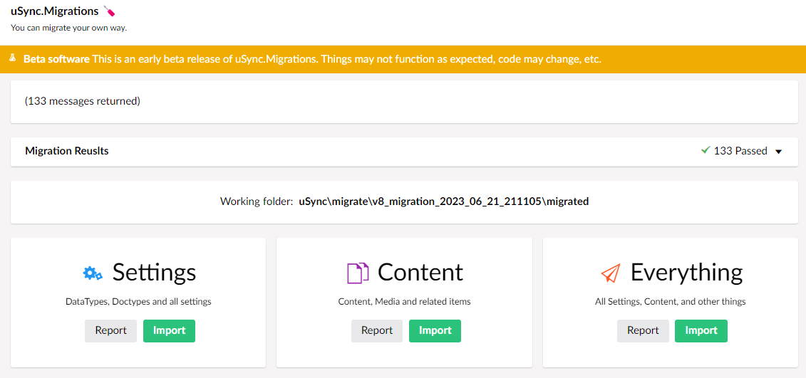
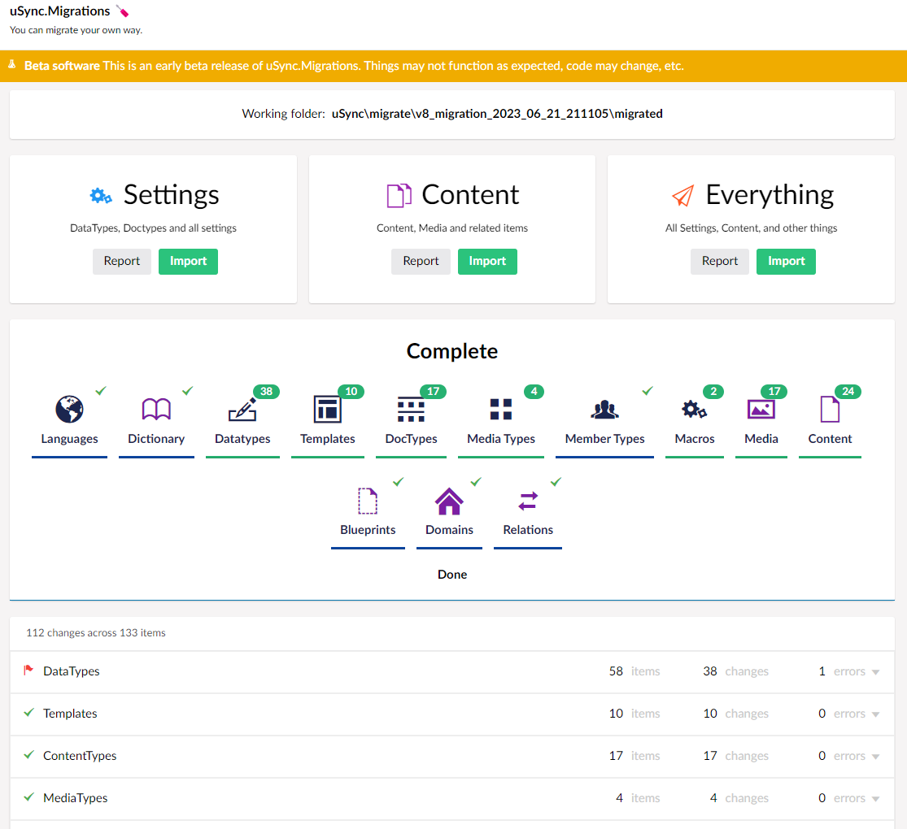
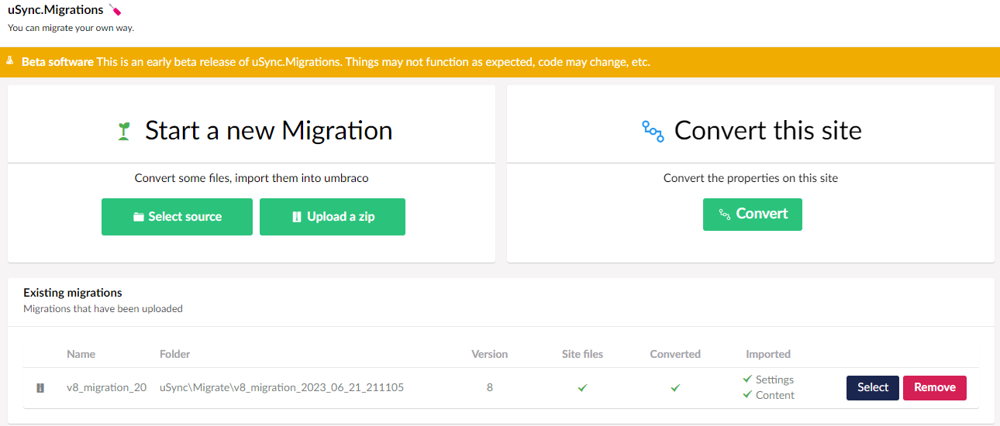

# Getting Started.

This is a quick guide to starting your migration journey with uSync Migrations.

> **Please Note:** uSync Migrations isn't going to be one button - here is your new site migration. uSync Migrations will help you with your settings and content, you will need to look at code, templates and all that other stuff.


## Step One : Pick a packer
*(Optional but recommended)*

uSync Packers are simple packages for Umbraco 7 and Umbraco 8, that use gather up the files from that version of Umbraco and give you something you can kick-start your migration with.

### On your source site install one of the `uSync.Migration.Packer` packages

| Umbraco 7 | Umbraco 8
| - | -
| [uSync.Migrations.Packer v7](https://clients.jumoo.co.uk/migrations/uSync.Migrations.Packer_7.0.1.zip) | [uSync.Migrations.Packer v8](https://clients.jumoo.co.uk/migrations/uSync.Migrations.Packer_8.0.0.zip)
| Minimum v7.15.10 | Minimum 8.18.8

> All Packers packages are available at https://clients.jumoo.co.uk/migrations/


A package will create a new uSync export, and grab some extra files such as the css/script and a specially generated `grid.config.js` file and put them all into a .zip package.

you can then use the .zip package on uSync Migrations to start the process properly.

## Step Two: Migrate!

You can start with a new blank install of Umbraco:

1. Install uSync

```
dotnet add package uSync
```

2. Install uSync.Migrations

```
dotnet add package uSync.Migrations --prerelease
```

3. Run your site, and navigate to the uSync Migrations section :



4. Upload your zip file created by the package.



> When you upload a zip file, uSync Migrations will find the correct uSync and site folders for you - you can do this yourself, but using the zip is much easier.

5. When uploading you should select the "migration plan" which controls the type of migration your want.



6. Submit.

## Convert

The first step of any migration with uSync Migrations is the conversion.

Converting the files takes the original uSync files and converts them to the latest version and depending on your plan it changes types, and upgrades things as it goes.

> This is the step that can convert files from Nested Content to Block List, and Grids to Block Grids. The actual changes don't occur until you import but the conversion is where the magic happens.

### Validation

Before a conversion occurs uSync Migrations will validate the folders and tell you of anything it doesn't know how to do.



> uSync Migrations comes with lots of mappers to convert old content types to new, but if it's missing one you need you can always write that converter and contribute back to the core uSync Migrations for others to benefit.

### Convert

Press the big green button, go on you know you want to!

## Import

Once you have converted your files you can perform the import.



Importing is the same as a normal uSync import except it comes from the migration folder.



## Enjoy & start the long journey

At this point, if everything has gone well you should have all your content and settings imported into your new site. Lovingly converted to new types (if you choose to do that) and ready for you to complete the migration.

All you have to do now is:
- Find replacements for all those packages you use to have.
- rewrite all the templates and views 😰
- Rewrite all your controllers, services, etc.

**It's going to take a little while longer than the migration just did.**

## Remember, you can always do it again.

uSync Migrations is designed so you can run the same migration again and again. You might run a migration once (or more) to get it right - but it's likely you will need to do it again before you go live. If you visit the uSync Migrations dashboard, you will now see a table of migrations that you have ran.



From the dashboard, you can re-run conversions, re-import things and generally tweak your migration process.


> Always have a backup, don't blame us if it goes wrong, wear sunscreen, and enjoy.
